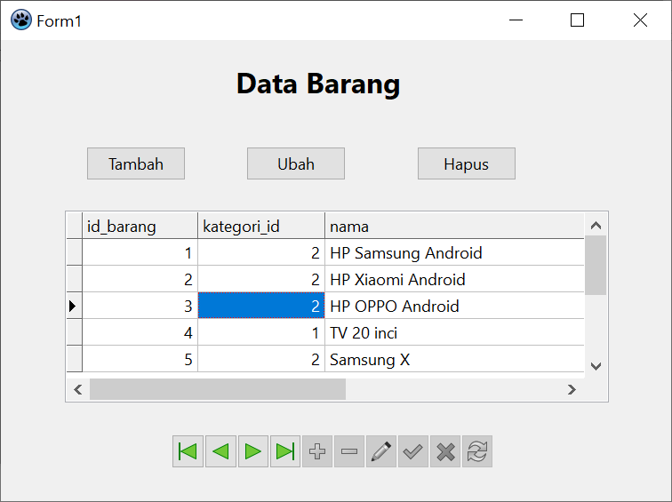
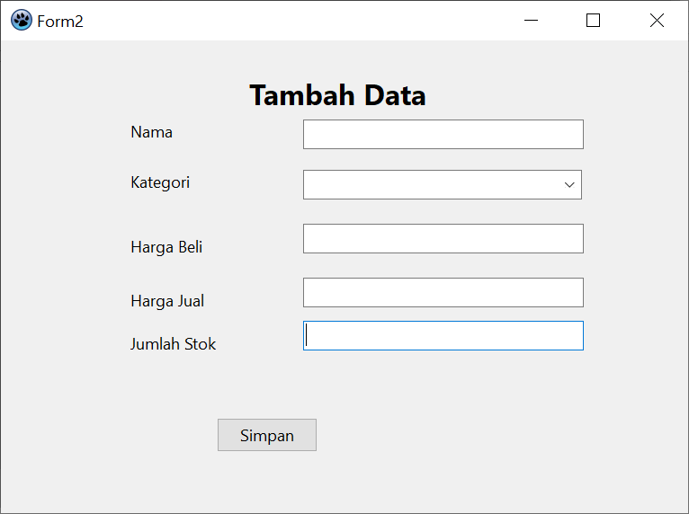
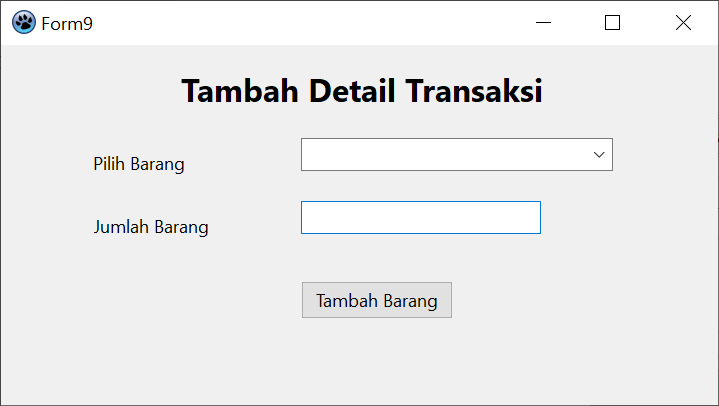

| Herliyansyah          | 312010387             |
|-----------------------|-----------------------|
|  TI.20.A.RPL-2        | PEMROGRAMAN VISUAL    |
| UJIAN AKHIR SEMESTER  | APLIKASI PENJUALAN    |

## UJIAN AKHIR SEMESTER

## SEMESTER 7

**Disini saya akan mengcapture setiap fiture pada project UAS yang saya buat**

Berikut ini adalah tampilan form utama
### 1. Tampilan Form Utama

**diatas adalah tampilan awal form,berikutnya adalah tampilan ***Form Login*** **

### 2. Form Login

**diatas adalah tampilan login sebelum masuk halaman kelola**

dan langkah berikutnya yaitu tampilan **Data Barang**

### 3. Tampilan Form Data Barang

**Diatas adalah tampilan Form Data Barang**

berikut nya akan menampilkan **tambah data barang** seperti gambar dibawah

### 4. Form Tambah Data Barang

**Diatas adalah contoh tampilan dari Form Data Barang**

langkah berikutnya adalah menampilkan form ubah barang

### 5. Form Ubah Barang

**Diatas adalah tampilan dari form ubah barang**

dan berikut nya adalah tampilan dari **Detail Barang**

### 6. Form Detail Barang

**Tampilan Detail Barang**

Berikutnya tampilan **Data Customer** sebagai berikut

### 7. Form Data Customer

**Diatas merupakan tampilan dari Form Data Customer**

tampilan berikutnya adalah tampilan **Transaksi Penjualan**

### 8. User Interface Transaksi Penjualan

**Diatas merupakan tampilan dari from Transaksi Penjualan**

Berikutnya adalah Form *Tambah Transaksi*

### 9. Form Tambah Transaksi

**Tampilan Tambah Transaksi**

berikutnya adalah tampilan **Tambah Detail Transaksi**

### 10. Form Tambah Detail Transaksi

**Diatas merupakan tampilan Tambah Detail Transaksi**

Tampilan berikutnya adalah **form cetak laporan**

### 11. Form Cetak Laporan

**Tampilan Cetak Laporan**

kemudian tampilan **Laporan**

### 12. Tampilan cetak laporan Transaksi

**Tampilan Cetak Laporan**

berikutnya tampilan **Cetak Faktur Laporan**

### 13. Tampilan cetak Faktur Penjualan

itu adalah Capture dari tampilan **UAS PROJECT** **PEMROGRAMAN VISUAL**

**TERIMA KASIH**